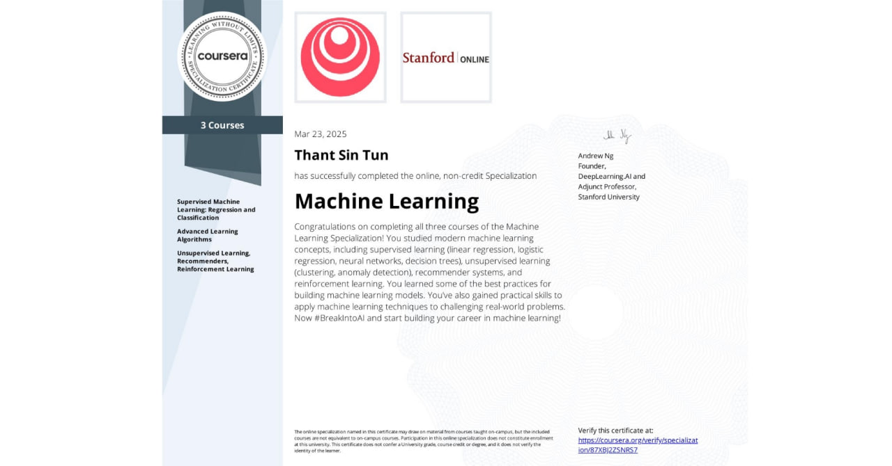
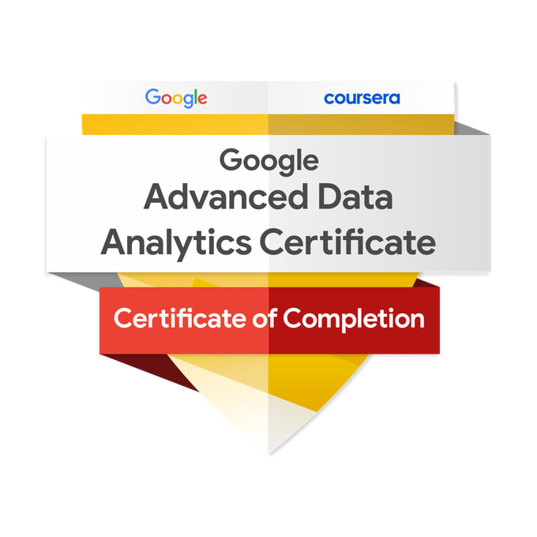

<h1 align="center">Hi there 👋 I'm Thant Sin Tun</h1>

  <b>Self-taught Data Scientist • AI & Machine Learning Enthusiast</b>

  

  <i>Turning data into insight, curiosity into skill.</i>

---

---

## About Me

- Passionate about **building intelligent systems**
- Interested in **Machine Learning, Deep Learning & Neural Networks**
- Currently learning **Python, ML algorithms, Time-series Analysis and Deep Learning architectures**
- Self-taught learner who enjoys solving **real-world problems**
- Goal: grow into a responsible **AI practitioner**

---
## Connect with Me

  <!-- Top row -->
  &nbsp;&nbsp;

  &nbsp;&nbsp;

  

  <!-- Bottom row -->
  &nbsp;&nbsp;

  

---

## Languages, ML Frameworks & Tools

  
    
  

---

## Focus Areas

- Machine Learning, Deep Learning & AI
- Natural Language Processing (NLP)

---

### 🎓 Certifications & Courses

<table width="100%" align="center">
  <tr>
    <td align="center" width="33%">
        
      <b>Machine Learning Specialization</b>  
      Coursera · Completed ✅
    </td>
    <td align="center" width="33%">
        
      <b>Advanced Data Analytics</b>  
      Google · Completed ✅
    </td>
    <td align="center" width="33%">
        
      <b>Data Scientist Associate</b>  
      DataCamp · Certified ✅
    </td>
  </tr>
</table>

---

## GitHub Activity & Stats

<!-- <table>
  <tr>
    <td>
      
    </td>
    <td>
      
    </td>
  </tr>
</table> -->

<table align="center">
    <tr>
        <td>
            
        </td>
        <!-- <td>
          
        </td> -->
    </tr>
</table>

---

  

### 🗓️ Contributions Calendar

---

