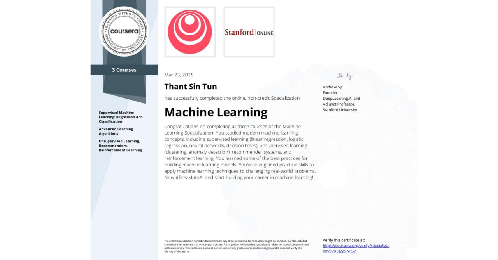
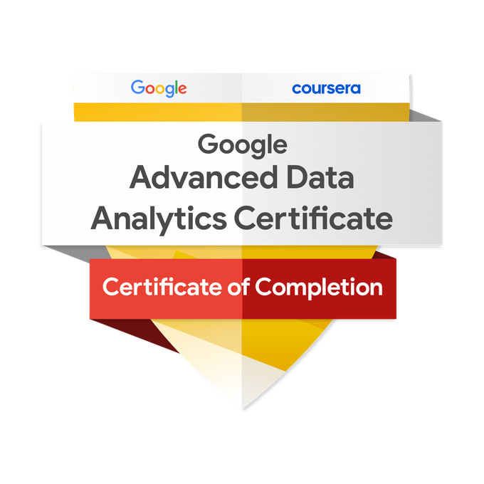

<h1 align="center">Hi there 👋 I'm Thant Sin Tun</h1>

  <b>AI Enginnering Intern • NLP Enthusiast</b>

  

  <i>Turning data into insight, curiosity into skill.</i>

---

<!--  -->

---

## About Me

Passionate about building intelligent systems with interests in Machine Learning, Deep Learning, and Neural Networks.  

Currently learning LLM architectures, Fine-tuning and RAG specializing in Natural Language Engineering and R&D🔬.

A self-driven learner aiming to become a responsible AI practitioner. 

 

---

## Connect with Me

  <!-- Top row -->
  &nbsp;&nbsp;

  &nbsp;&nbsp;

  

  <!-- Bottom row -->
  &nbsp;&nbsp;

  

---

## Languages, ML Frameworks & Tools

  
    
  
  
  
  <!-- 
   -->

---

## Focus Areas

- Machine Learning, Deep Learning & Neural Networks

- Natural Language Processing (NLP) & LLMs 

- Retrieval-Augmented Generation (RAG) 
  
- MLOps & Model Lifecycle Management 

---

## GitHub Activity & Stats

    
  

  

---

### 🎓 Certifications & Courses

<table width="100%" align="center">
  <tr>
    <td align="center" width="33%">
        
      <b>ML Specialization</b>  
      Coursera · Completed ✅
    </td>
    <td align="center" width="33%">
        
      <b>Advanced Data Analytics</b>  
      Google · Completed ✅
    </td>
    <td align="center" width="33%">
        
      <b>Data Scientist Associate</b>  
      DataCamp · Certified ✅
    </td>
  </tr>
</table>

---

### 🗓️ Contributions Calendar

<!-- Streak stats -->
<!-- 

  

 -->

---

